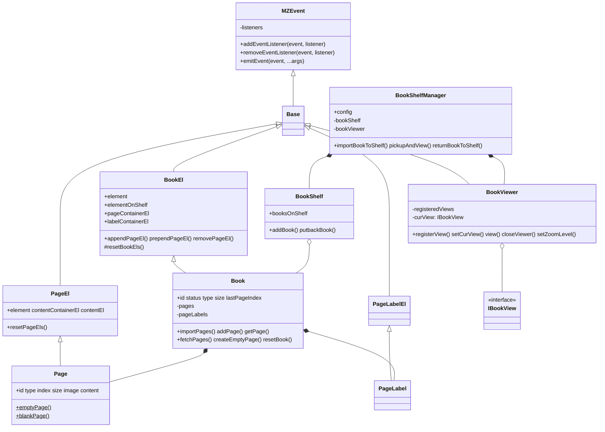
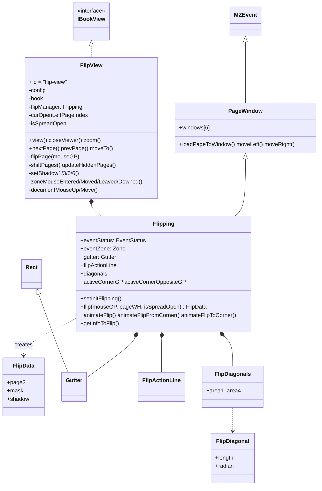

# 클래스 모델

## core

**데이터 클래스가 DOM 클래스를 상속**하는 구조입니다. `XxxEl` 은 요소 생성/정리만, `Xxx` 는 데이터와 동작을 담당합니다.

## flipview

### 역할 분리 원칙

| 클래스 | 알고 있는 것 | 모르는 것 |
| --- | --- | --- |
| `FlipView` | DOM, CSS 변수, 책, 현재 펼친 페이지 | 기하 공식 |
| `Flipping` | 좌표, 상태, 애니메이션 타이밍 | 어떤 요소에 적용되는지 (예외: zone 크기 측정, `--page2-origin`) |
| `FlipData` | 한 프레임의 계산 결과 | 상태 |
