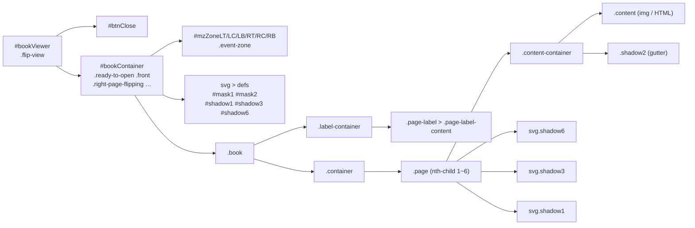
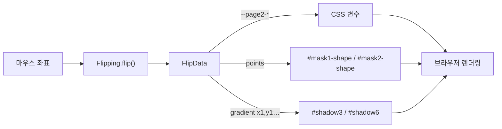

# DOM 과 CSS 변수

## DOM 트리 (FlipView 가 열린 상태)

## 페이지 배치는 `nth-child` 로 결정된다

`.container` 의 자식 순서 = [Page Window](../flipview/page-window.md) 의 슬롯 순서입니다.
그래서 **DOM 순서를 바꾸는 것만으로 페이지가 이동**합니다.

| nth-child | 슬롯 | 위치 | z-index | 역할 (오른쪽 넘김 시) |
| --- | --- | --- | --- | --- |
| 1 | windows[0] | 왼쪽 | 1 | 숨김 |
| 2 | windows[1] | 왼쪽 | 2 | 숨김 |
| 3 | windows[2] | 왼쪽 | 3 | **보이는 왼쪽 페이지** |
| 4 | windows[3] | 오른쪽 | 3 | **보이는 오른쪽 페이지** = page1 |
| 5 | windows[4] | 오른쪽 | 2 | 넘어오는 뒷면 = page2 (회전) |
| 6 | windows[5] | 오른쪽 | 1 | 그 아래 = page3 |

## CSS 변수 (document.documentElement)

| 변수 | 설정 위치 | 의미 |
| --- | --- | --- |
| `--closed-book-width` / `--opened-book-width` / `--book-height` | `FlipView.setViewer()` | 책 크기 |
| `--page-width` / `--page-height` / `--page-diagonal-length` | `setViewer()` | 페이지 크기 |
| `--page2-top` / `--page2-left` / `--page2-rotate` | `flipPage()` 매 프레임 | 넘어가는 페이지의 위치/회전 |
| `--page2-origin` | `Flipping.setInitFlipping()` | 회전 기준점 |
| `--shadow5-opacity` | `setShadow5()` | 그림자 투명도 |

프레임마다 JS는 **숫자만 계산해서 속성/변수에 쓰고**, 실제 모양은 CSS와 SVG가 그립니다.
