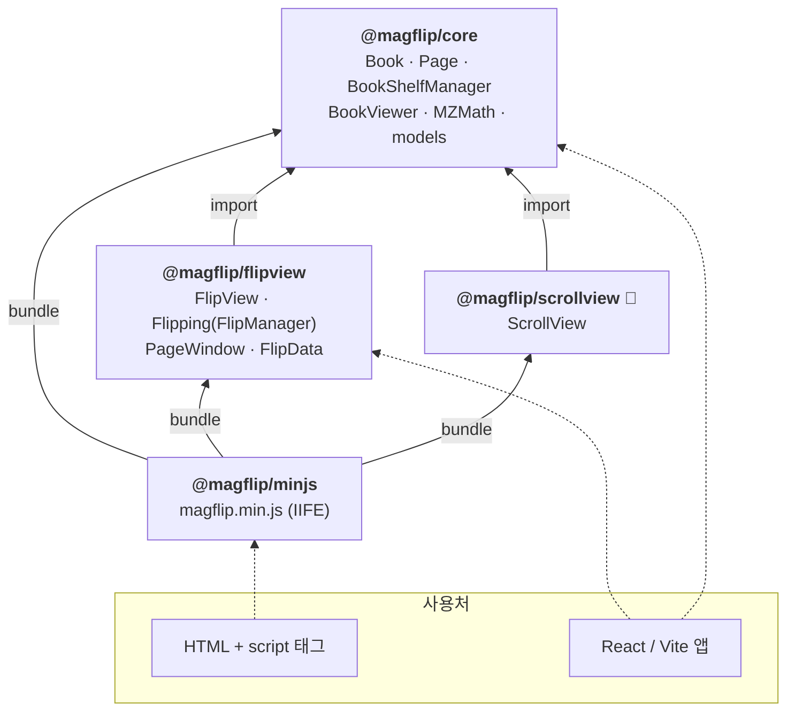
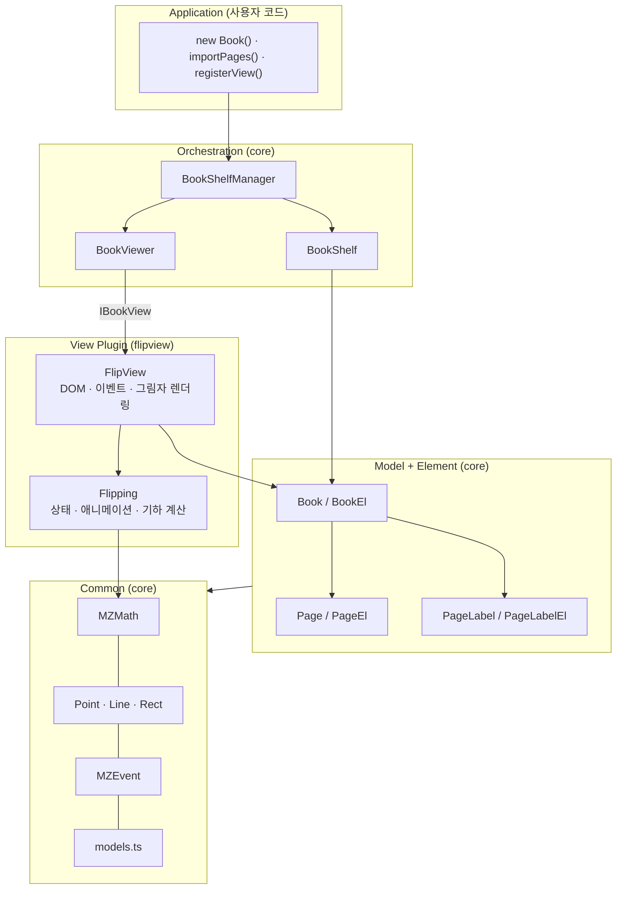
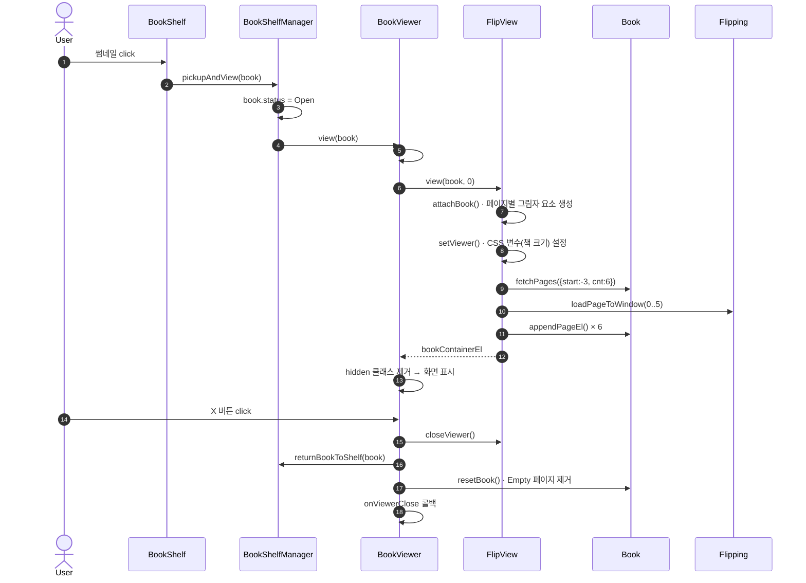

# 시스템 구조

## 1. 패키지 의존 관계



- **core** 는 다른 MagFlip 패키지에 의존하지 않습니다. 뷰의 규약은 `IBookView` 인터페이스로만 정의합니다.
- **flipview / scrollview** 는 `IBookView` 를 구현하는 **뷰 플러그인**입니다.
- **minjs** 는 코드가 없고, 세 패키지를 re-export 한 뒤 하나의 번들로 묶습니다.

## 2. 레이어



| 레이어 | 책임 | 규칙 |
| --- | --- | --- |
| Application | 책 데이터 구성, 뷰 등록 | 공개 API만 사용 |
| Orchestration | 책장 ↔ 뷰어 사이에서 책을 이동, 뷰 선택 | 특정 뷰 구현을 몰라야 함 |
| View Plugin | 책을 화면에 렌더링하고 사용자 입력을 처리 | `IBookView` 구현 |
| Model + Element | 데이터(`Book`)와 DOM(`BookEl`)을 상속으로 결합 | `XxxEl` 은 DOM 생성만 담당 |
| Common | 수학, 도형, 이벤트, 타입 | DOM/상태에 의존하지 않는 순수 코드 우선 |

## 3. 책을 여는 런타임 흐름



## 4. 뷰 플러그인 규약 (`IBookView`)

```ts
export interface IBookView {
  readonly id: string;                 // 'flip-view' → #bookViewer 의 class 로도 사용
  readonly bookContainerEl: HTMLElement;
  getBookContainerEl(): HTMLElement;
  view(book: IBookData, openPageIndex?: number): HTMLElement;
  closeViewer(): void;
  zoom(zoomLevel: number): void;
  nextPage(offsetY?: number): void;
  prevPage(offsetY?: number): void;
  moveTo(pageIndex: number, offsetY?: number): void;
}
```

새 뷰를 만들 때는 `packages/scrollview` 를 템플릿으로 사용하세요. CSS는 `#bookViewer.<view id>` 로 범위를 한정합니다.
