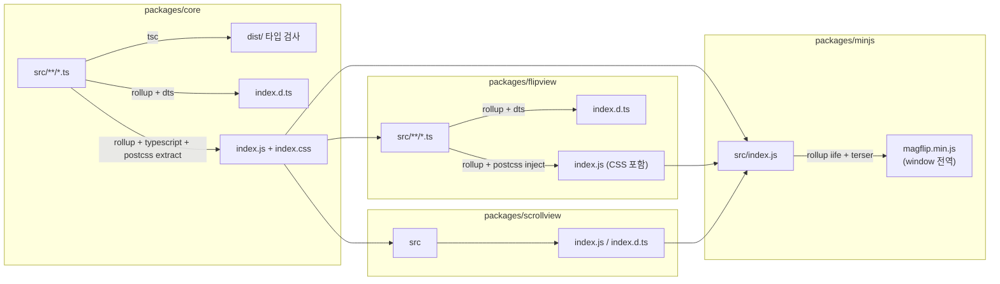
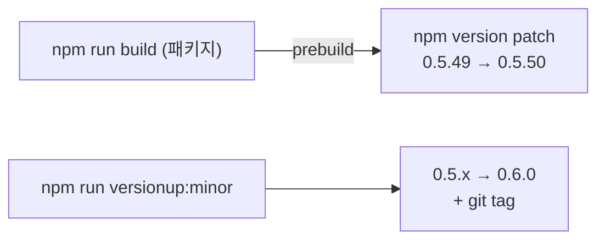
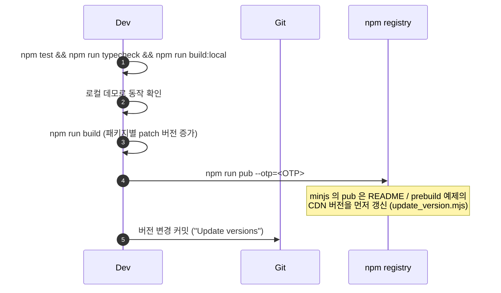

# 빌드와 배포

## 빌드 파이프라인



| 패키지 | 출력 | CSS 처리 |
| --- | --- | --- |
| core | `index.js`, `index.d.ts`, `index.css` | 별도 파일로 추출 |
| flipview | `index.js`, `index.d.ts` | JS 안에 주입 (+ core `index.css` import) |
| scrollview | `index.js`, `index.d.ts` | JS 안에 주입 |
| minjs | `magflip.min.js` (+ dev 빌드 시 `.map`) | JS 안에 주입 |

빌드 결과는 모두 `.gitignore` 대상이며, npm 배포 시 `.npmignore` 로 `src` 등이 제외됩니다.

## 버전 규칙



- 패키지마다 버전이 **독립적**입니다. (core 0.5.49, flipview 0.5.45 …)
- 루트 `package.json` 버전은 배포되지 않습니다. (`private: true`)

## 배포 절차



```bash
# 전체
npm run build
npm run pub --otp=123456

# 개별 패키지
npm run build:core
npm run pub --workspace packages/core --otp=123456
```

:::warning 배포 순서
flipview / scrollview 는 core 를, minjs 는 모두를 **빌드 시점에 번들**합니다.
core 를 수정했다면 core → flipview → scrollview → minjs 순서로 모두 다시 빌드·배포해야 CDN 번들에 반영됩니다.
:::
