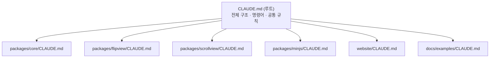

# Claude Code 설정 (CLAUDE.md & Skills)

AI 코딩 도구(Claude Code)가 저장소 규칙을 이해하도록 폴더마다 가이드를 둡니다.

## Skills

| 위치 | Skill | 언제 쓰나 |
| --- | --- | --- |
| `.claude/skills/` | `local-dev` | 빌드·테스트·로컬 데모 실행 |
| `.claude/skills/` | `release` | npm 배포 절차 |
| `packages/core/.claude/skills/` | `core-model-change` | 책/페이지 데이터·공개 API 변경 |
| `packages/flipview/.claude/skills/` | `flip-effect-debug` | 넘김 모양·그림자·이벤트 버그 수정 |
| `packages/scrollview/.claude/skills/` | `new-view-plugin` | `IBookView` 구현 추가 |
| `packages/minjs/.claude/skills/` | `bundle-check` | 번들 구성 변경·검증 |
| `website/.claude/skills/` | `write-docs` | 문서 작성·다이어그램 추가 |
| `docs/examples/.claude/skills/` | `update-examples` | 예제 페이지 수정 |

구조를 바꾸면 **코드 → dev-docs → CLAUDE.md → skill** 순서로 함께 갱신하세요.
