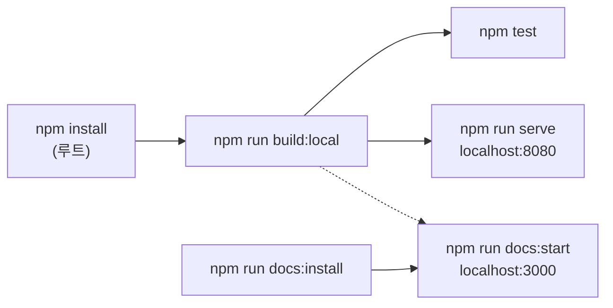

# 로컬 개발 환경

## 요구 사항

- Node.js 18 이상 (22 권장), npm 10

## 한 번에 보기



## 1. 설치

```bash
npm install
```

npm workspaces 가 `packages/*` 를 `node_modules/@magflip/*` 에 **심볼릭 링크**합니다. 그래서 flipview 는 로컬 core 빌드 결과를 그대로 사용합니다.

## 2. 빌드 (버전 변경 없음)

```bash
npm run build:local
```

`core → flipview → scrollview → minjs` 순서로 빌드합니다. 순서가 중요합니다. (flipview 는 빌드된 `@magflip/core/index.js` 를 import)

:::danger `npm run build` 와의 차이
각 패키지의 `build` 스크립트에는 `prebuild: npm version patch` 가 걸려 있어 **실행할 때마다 package.json 버전이 올라갑니다**.
로컬 확인용으로는 반드시 `build:local` 을 사용하세요. `build` 는 [배포](./build-and-release.md) 때만 사용합니다.
:::

## 3. 브라우저에서 확인

```bash
npm run serve
```

| URL | 내용 |
| --- | --- |
| http://localhost:8080/docs/examples/local/ | **로컬 빌드 번들** 테스트 페이지 (Prev/Next/Move/Zoom 툴바) |
| http://localhost:8080/docs/examples/prebuild/magflip.html | CDN 번들 예제 |

`npm run dev` 는 `build:local` + `serve` 를 한 번에 실행합니다.

### 수정 → 확인 루프

```bash
# 터미널 1: core 소스 변경 → packages/core/index.js 재빌드
npm run build:watch:core
# 터미널 2: flipview 소스 또는 core 빌드 결과 변경 → packages/flipview/index.js 재빌드
npm run build:watch:flipview
# 터미널 3: 위 결과 변경 → magflip.min.js 재번들 (sourcemap 포함)
npm run build:dev:watch:minjs
# 터미널 4
npm run serve
```

브라우저 콘솔에서 `window.flipView`, `window.bookViewer`, `window.shelfManager` 로 내부 상태를 확인할 수 있습니다.

## 4. 테스트 & 타입 체크

```bash
npm test          # Jest (packages/flipview/__tests__)
npm run typecheck # 모든 패키지 tsc --noEmit
```

Jest 는 `moduleNameMapper` 로 `@magflip/core` 를 **core 의 TypeScript 소스**에 연결하므로 core 를 빌드하지 않아도 됩니다.

## 5. React 예제

```bash
cd docs/examples/react-ts
npm install
npm link ../../../packages/core ../../../packages/flipview
npm run dev
```

## 6. 문서 사이트

```bash
npm run docs:install   # 최초 1회
npm run docs:start     # build:local → 데모 복사 → http://localhost:3000
npm run docs:build     # 정적 빌드 (깨진 링크가 있으면 실패)
```
