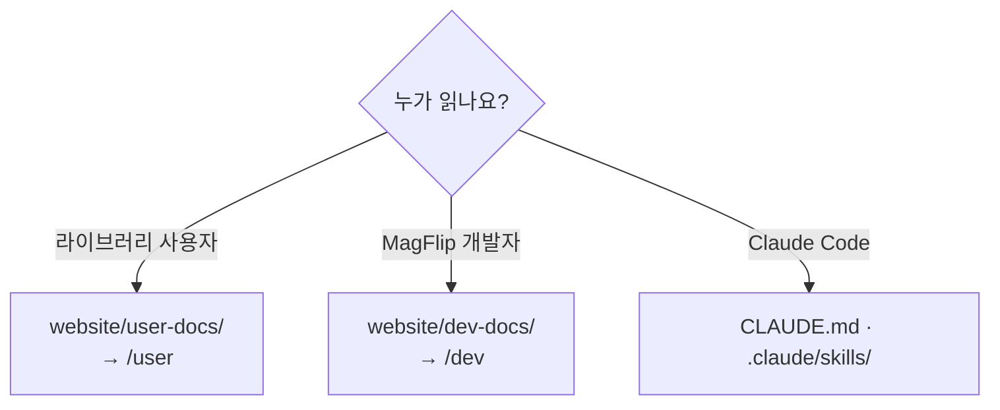

# 문서 작성 가이드

## 어느 폴더에 쓰나?



| 사용자 문서 | 개발자 문서 |
| --- | --- |
| 공개 API, 옵션, 예제 코드 | 내부 클래스, 상태, 계산, 빌드 |
| "어떻게 쓰나" | "어떻게 동작하나 / 어떻게 고치나" |
| private 멤버 언급 금지 | 파일 경로와 함수 이름을 구체적으로 |

## 새 문서 추가

1. 해당 폴더에 `.md` (컴포넌트를 쓰면 `.mdx`) 파일 생성
2. front matter 에 `title`, `sidebar_position` 지정
3. 새 폴더라면 `_category_.json` 추가 → 사이드바는 자동 생성
4. `npm run docs:build` 로 깨진 링크 확인

```md
---
sidebar_position: 3
title: 새 문서
---
```

## 시각화 도구

| 표현하고 싶은 것 | 도구 |
| --- | --- |
| 흐름, 의존 관계 | ` ```mermaid flowchart ` |
| 호출 순서 | ` ```mermaid sequenceDiagram ` |
| 상태 전이 | ` ```mermaid stateDiagram-v2 ` |
| 클래스 관계 | ` ```mermaid classDiagram ` |
| 격자 배치 (Zone, 슬롯) | ` ```mermaid block-beta ` |
| 폴더 트리 | `<FileTree nodes={[...]} />` (`@site/src/components/FileTree`) |
| 실제 동작 | `<DemoFrame />` (`@site/src/components/DemoFrame`) |
| 수학 그림 | `website/static/img/flip-math/` 이미지 |

:::tip MDX 주의
`.md` 본문에 `<`, `{` 를 그대로 쓰면 MDX 파싱 에러가 날 수 있습니다. 코드 스팬(`` `<div>` ``)으로 감싸세요.
:::
