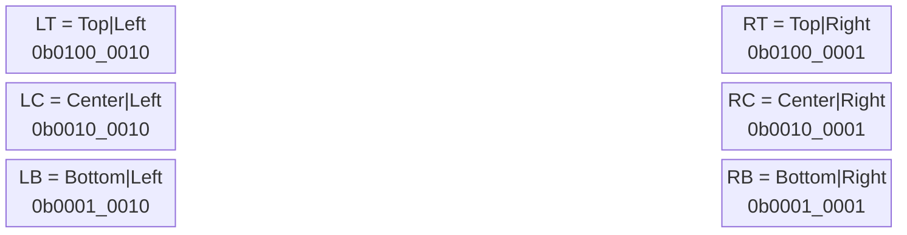
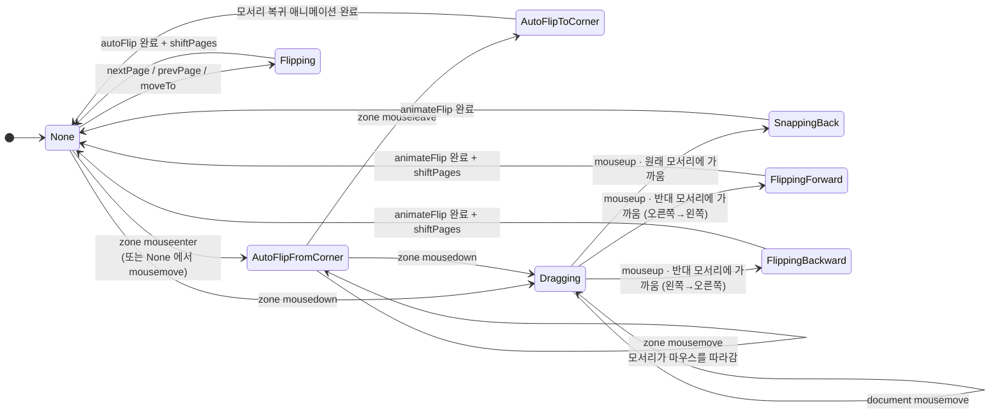
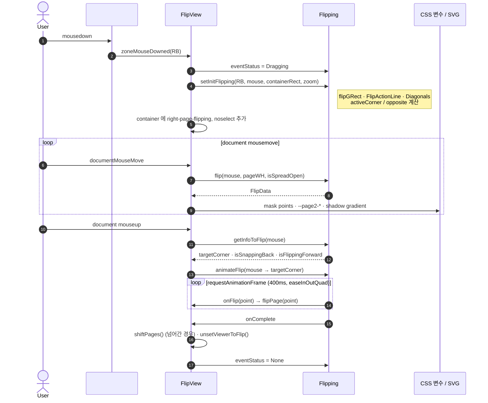

# 이벤트 흐름

## Zone (비트 플래그)

비트 플래그라 `zone & Zone.Left`, `zone & Zone.Top` 처럼 **방향만 검사**할 수 있습니다.

## EventStatus 상태 머신

값도 비트 플래그로 설계되어 있습니다.

| 상태 | 값 | 포함 비트 |
| --- | --- | --- |
| `None` | `0b0000_0000` | – |
| `AutoFlip` | `0b0000_1000` | AutoFlip |
| `AutoFlipFromCorner` | `0b0000_1100` | AutoFlip |
| `AutoFlipToCorner` | `0b0000_1010` | AutoFlip |
| `Flipping` | `0b1000_0000` | Flipping |
| `SnappingBack` | `0b1001_0000` | Flipping |
| `FlippingForward` | `0b1010_0000` | Flipping |
| `FlippingBackward` | `0b1100_0000` | Flipping |
| `Dragging` | `0b1000_0000_0000` | Dragging |

`status & EventStatus.Flipping` 이 참이면 "어떤 종류든 자동으로 넘어가는 중" 이므로 새 입력을 무시합니다.

## 드래그로 넘기기 시퀀스

## 애니메이션 요약

| 함수 | 트리거 | 시간 | 이징 | 경로 |
| --- | --- | --- | --- | --- |
| `Flipping.animateFlipFromCorner` | zone 진입 | 300ms | easeInOutQuad | 모서리 → 마우스 (`AutoFlipType.MouseCursor`) |
| `Flipping.animateFlipToCorner` | zone 이탈 | 300ms | easeInOutQuad | 마우스 → 모서리 |
| `Flipping.animateFlip` | mouseup | 400ms | easeInOutQuad | 마우스 → 목표 모서리 (직선) |
| `FlipView.autoFlip` | next/prev/moveTo | 500ms | linear + `sin` | 오른쪽 아래 → 왼쪽 끝 (곡선, `offsetY`) |
