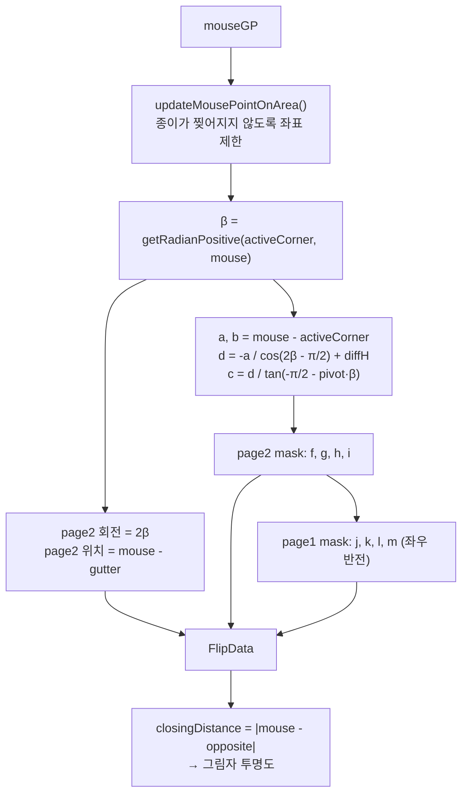
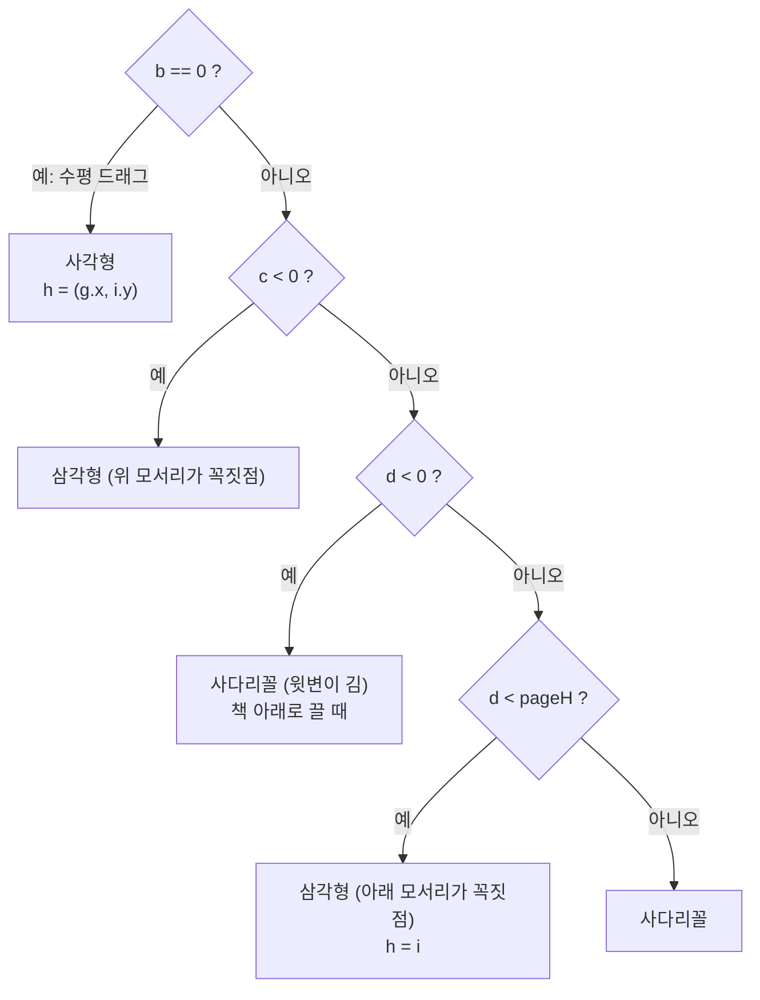

# Flip 기하 계산

`Flipping.flip(mouseGP, pageWH, isSpreadOpen)` 은 마우스 위치 하나로 **한 프레임의 모든 모양**을 계산합니다.

## 좌표계와 용어

| 용어 | 의미 |
| --- | --- |
| **GP** (Global Point) | 뷰포트 기준 좌표 (`clientX`, `clientY`) |
| **Gutter** | 펼친 책 가운데 접히는 선 |
| **FlipActionLine** | 드래그 기준 수평선. 코너 Zone이면 책의 위/아래 변, Center Zone이면 마우스 y |
| **activeCornerGP** | 잡은 모서리 (예: 오른쪽 아래) |
| **activeCornerOppositeGP** | Gutter 기준 대칭 모서리 = 넘어간 뒤 도착점 |
| **page1 / page2** | 지금 보이는 면 / 넘어오는 뒷면 |

## 전체 계산 파이프라인

- `pivot` 은 오른쪽 넘김 `+1`, 왼쪽 넘김 `-1` 로, 같은 공식을 좌우에 재사용하기 위한 부호입니다.

## 오른쪽 아래 모서리를 잡았을 때

- 점 `f, g, h, i` : page2(뒷면)에 씌우는 mask polygon
- 점 `j, k, l, m` : page1(앞면)에서 잘라낼 mask polygon
- `A = a`, `B = b`, `C = c`, `D = d` 가 코드의 변수명과 대응합니다.

## Mask 모양 분기

## 마우스 제한 영역 (Area 1~4)

실제 종이는 Gutter에 붙어 있으므로 모서리가 갈 수 있는 범위가 제한됩니다.
`FlipDiagonals` 가 영역별 반지름과 각도 범위를 계산하고 `updateMousePointOnArea()` 가 좌표를 원 위로 끌어옵니다.

| Area | 조건 | 보정 |
| --- | --- | --- |
| 1 (위) | Gutter 아래 중앙에서의 거리 > 대각선 길이 | 그 원 위의 점으로 |
| 2 (아래) | Gutter 위 중앙에서의 거리 > 대각선 길이 | 그 원 위의 점으로 |
| 3 (오른쪽) | FlipActionLine 오른쪽 끝 바깥 | 오른쪽 끝 점으로 |
| 4 (왼쪽) | FlipActionLine 왼쪽 끝 바깥 | 왼쪽 끝 점으로 |

## 그림자

| 이름 | 요소 | 계산 함수 | 표현 |
| --- | --- | --- | --- |
| shadow1 | `svg.shadow1 path` | `setShadow1` | 표지를 닫을 때 위쪽 곡선 |
| shadow2 | `.shadow2` div | CSS | Gutter 쪽 고정 그림자 |
| shadow3 | `svg.shadow3 polygon` + `#shadow3` gradient | `setShadow3` | 넘어오는 뒷면(page2)의 접힘 하이라이트 |
| shadow5 | CSS `--shadow5-opacity` | `setShadow5` | 회전 각도에 따른 투명도 |
| shadow6 | `svg.shadow6 polygon` + `#shadow6` gradient | `setShadow6` | page1 위에 드리우는 그림자 |

모든 그림자 강도는 `closingDistance / (pageWidth / 3)` 로 스케일되어 **도착 모서리에 가까울수록 옅어집니다**.

## 줌 처리

계산은 화면 좌표(줌 적용됨)로 하고, SVG/CSS에 쓸 때 `/ zoomLevel` 로 되돌립니다. (`FlipData.printPage1MaskShape(zoomLevel)` 등)
