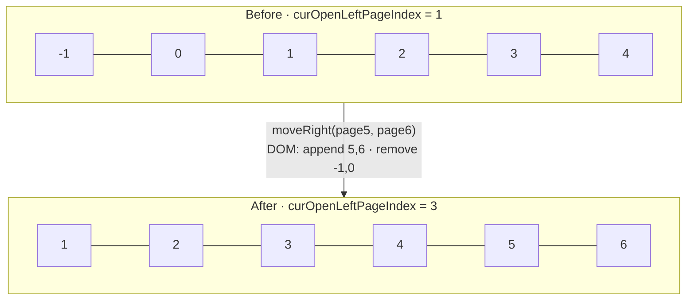
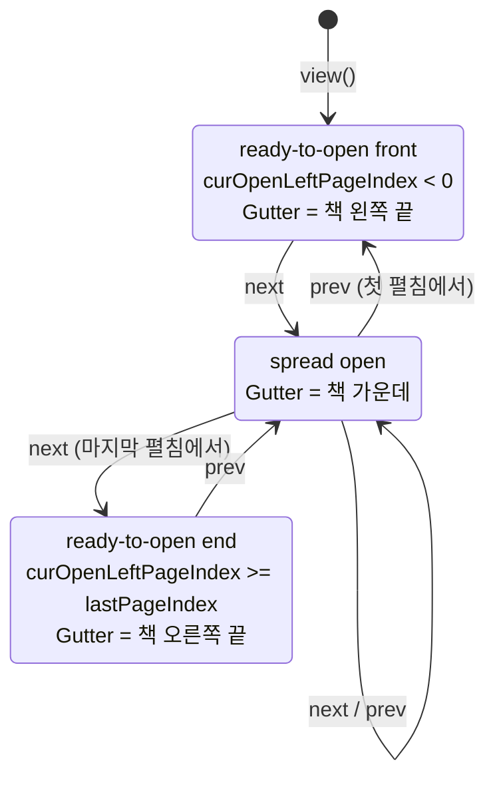
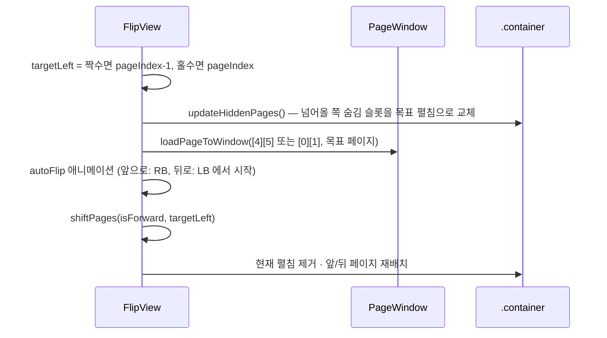

# Page Window

FlipView 는 책의 모든 페이지를 DOM 에 올리지 않고, **넘김에 필요한 6장만** 유지합니다.

## 6칸 슬롯

- `curOpenLeftPageIndex` = 슬롯 `[2]` 에 있는 페이지 index (처음엔 `-1`)
- 넘길 때 **active page** 번호: 1 = 지금 보이는 면, 2 = 넘어오는 뒷면, 3 = 그 아래

| 넘기는 쪽 | page1 | page2 | page3 |
| --- | --- | --- | --- |
| 오른쪽 → 다음 (`Zone.Right`) | `[3]` | `[4]` | `[5]` |
| 왼쪽 → 이전 (`Zone.Left`) | `[2]` | `[1]` | `[0]` |

코드: `FlipView.getActivePage(activePageNum)`

## 다음 페이지로 넘긴 후 (`shiftPages(true)`)

1. `Flipping.moveRight(newPage1, newPage2)` — 앞 두 칸 제거, 뒤에 두 칸 추가
2. `book.appendPageEl()` × 2, `book.removePageEl()` × 2 — DOM 순서를 슬롯과 일치
3. `updateDimension()` — 닫힘/펼침 상태와 Gutter 재계산

책에 없는 index(음수, lastPageIndex 초과)는 `Book.getPage(i, true)` 가 **Empty 페이지**를 만들어 채웁니다.

## 책 상태 (3가지)

코드: `FlipView.updateDimension()` → `setReadyToOpenForward()` / `setSpreadOpen()` / `setReadyToOpenBackward()`

## moveTo(pageIndex)

여러 장을 한 번에 넘길 때도 애니메이션은 **한 번**입니다. 넘어오는 뒷면만 목표 페이지로 바꿔치기합니다.

