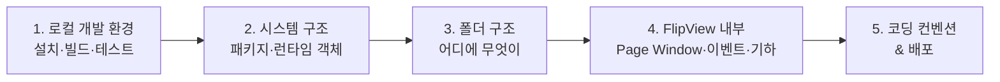

# 개발자 가이드

MagFlip **자체를 개발·유지보수**하는 사람을 위한 문서입니다.
라이브러리를 _사용_하는 방법은 [사용자 가이드](/user/intro)를 참고하세요.

## 이 문서를 읽는 순서

| 알고 싶은 것 | 문서 |
| --- | --- |
| 처음 clone 후 무엇을 실행하나? | [로컬 개발 환경](./development/local-setup.md) |
| 패키지들이 어떻게 연결되나? | [시스템 구조](./architecture/overview.md) |
| 어떤 파일을 고쳐야 하나? | [폴더 구조](./architecture/folder-structure.mdx) |
| 클래스 관계는? | [클래스 모델](./architecture/class-model.md) |
| 페이지가 어떻게 교체되나? | [Page Window](./flipview/page-window.md) |
| 마우스 이벤트 → 애니메이션 흐름은? | [이벤트 흐름](./flipview/event-flow.md) |
| 접힘 모양/그림자 계산은? | [Flip 기하 계산](./flipview/flip-geometry.md) |
| 코드 스타일 규칙은? | [코딩 컨벤션](./development/coding-conventions.md) |
| npm 배포는? | [빌드와 배포](./development/build-and-release.md) |
| 알려진 문제는? | [알려진 이슈](./known-issues.md) |

## 30초 요약

- **npm workspaces 모노레포**: `packages/core`, `flipview`, `scrollview`, `minjs`
- **TypeScript + Rollup** 으로 각 패키지를 ESM(`index.js`) + 타입(`index.d.ts`)으로 빌드
- `minjs` 는 모든 패키지를 IIFE 번들(`magflip.min.js`)로 묶어 전역에 노출
- UI 프레임워크 없이 **DOM을 직접 생성**하고, Flip 효과는 **SVG mask + CSS 변수 + transform** 으로 구현
