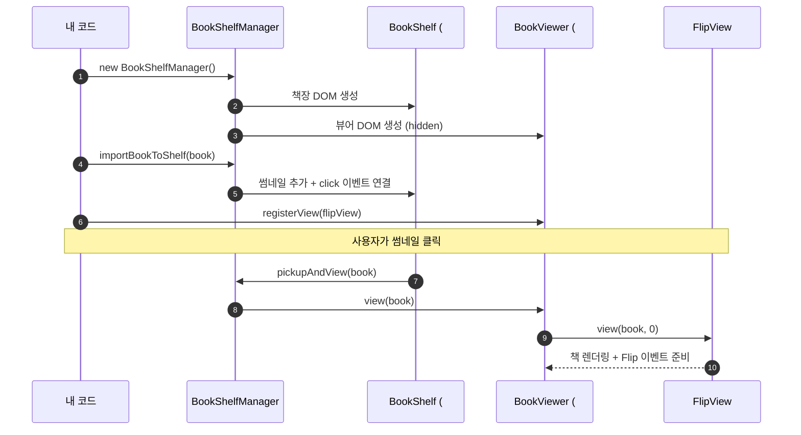

# 빠른 시작

HTML 파일 하나로 Flip Book을 띄워 봅니다.

## 1. 준비물

- 페이지 이미지 (예: `page0.jpg` ~ `page5.jpg`)
- 모든 페이지의 크기가 같아야 합니다 (예: 700 × 700 px).

## 2. 전체 코드

```html title="index.html"
<!DOCTYPE html>
<html>
<head>
  <script src="https://cdn.jsdelivr.net/npm/@magflip/minjs@0.5.48/magflip.min.js"></script>
</head>
<body>
  <script>
    document.addEventListener('DOMContentLoaded', () => {
      // (1) 페이지 데이터 준비
      const pages = [0, 1, 2, 3, 4, 5].map((i) => ({
        id: `page${i}`,
        index: i,
        image: `./images/page${i}.jpg`,
      }));

      // (2) 책 생성 + 페이지 등록
      const cover = pages[0].image;
      const book = new Book({
        id: 'my-book',
        lastPageIndex: 5,
        thumbnails: { spine: cover, small: cover, medium: cover, cover: { front: cover, back: cover } },
      });
      book.importPages(pages, { width: 700, height: 700 });

      // (3) 책장 매니저 생성 + 책 등록
      const shelfManager = new BookShelfManager();
      shelfManager.importBookToShelf(book);

      // (4) Flip 뷰 등록
      const bookViewer = shelfManager.getBookViewer();
      const flipView = new FlipView();
      bookViewer.registerView(flipView);
      bookViewer.setCurView(flipView.id);
    });
  </script>
</body>
</html>
```

브라우저에서 열면 책장에 썸네일이 보이고, 클릭하면 Flip 뷰어가 열립니다.

## 3. 무슨 일이 일어났나요?



## 4. 책장 없이 바로 열기

책장을 숨기고 코드로 바로 책을 열 수도 있습니다.

```js
const shelfManager = new BookShelfManager({ hideBookShelf: true });
shelfManager.importBookToShelf(book);
// ... registerView / setCurView ...
shelfManager.pickupAndView(book);
```

## 다음 단계

- [책과 페이지 이해하기](../guides/book-and-pages.md)
- [뷰어 제어하기](../guides/viewer-control.md)
