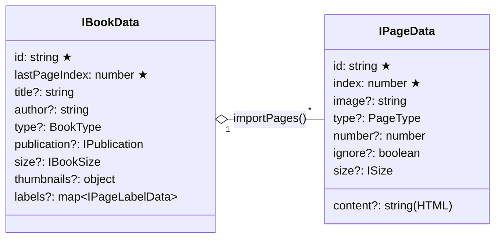
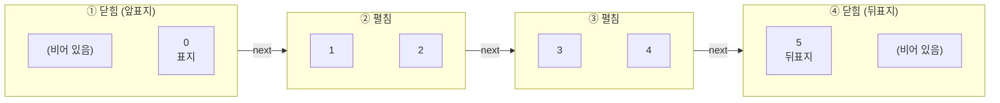

# 책과 페이지

## 데이터 구조



★ 표시는 필수 값입니다.

### Book 옵션

| 속성 | 타입 | 기본값 | 설명 |
| --- | --- | --- | --- |
| `id` | `string` | – | 책의 고유 ID. 한 페이지 안에서 겹치지 않아야 합니다. |
| `lastPageIndex` | `number` | – | 마지막 페이지의 index. **짝수이면 자동으로 +1** 되어 홀수로 맞춰집니다. |
| `thumbnails.medium` | `string` | `resources/default_medium.webp` | 책장에 표시될 썸네일 이미지 |
| `title`, `author` | `string` | `"Title"`, `"Author"` | 책 정보 (현재 화면에는 표시되지 않음) |
| `type` | `BookType` | `Book` | `Book` / `Magazine` / `Newspaper` |
| `labels` | `{ [n]: IPageLabelData }` | `{}` | [페이지 라벨](./page-labels.md) |

### Page 옵션

| 속성 | 타입 | 설명 |
| --- | --- | --- |
| `id` | `string` | 페이지 ID |
| `index` | `number` | 0부터 시작하는 페이지 순서 |
| `image` | `string` | 페이지 이미지 URL. ``로 렌더링됩니다. |
| `content` | `string` | 페이지에 넣을 HTML 문자열. `image`보다 먼저 렌더링됩니다. |

## 페이지 크기

`importPages(pages, size)` 의 `size` 가 **한 쪽 페이지 크기**입니다. 펼친 책의 너비는 자동으로 `width × 2` 가 됩니다.

```js
book.importPages(pages, { width: 700, height: 700 });
// closed: 700 × 700, opened: 1400 × 700
```

## 페이지 index와 펼침(Spread)

MagFlip은 **표지(index 0)가 오른쪽**에 오는 방식으로 책을 펼칩니다.
왼쪽 페이지는 항상 **홀수** index, 오른쪽 페이지는 **짝수** index 입니다.



- 페이지 수는 **짝수**(`lastPageIndex`가 홀수)로 맞추는 것이 자연스럽습니다.
- 첫 페이지와 마지막 페이지가 보일 때는 책이 한 쪽 너비로 **닫힌 상태**로 표시됩니다.

## 이미지 대신 HTML 넣기

```js
book.importPages([
  { id: 'p0', index: 0, content: '<h1 style="padding:40px">Hello</h1>' },
  { id: 'p1', index: 1, image: './page1.jpg' },
], { width: 600, height: 900 });
```

:::caution
`content` 는 `innerHTML` 로 삽입됩니다. 사용자 입력을 그대로 넣지 말고 신뢰할 수 있는 HTML만 사용하세요.
:::
