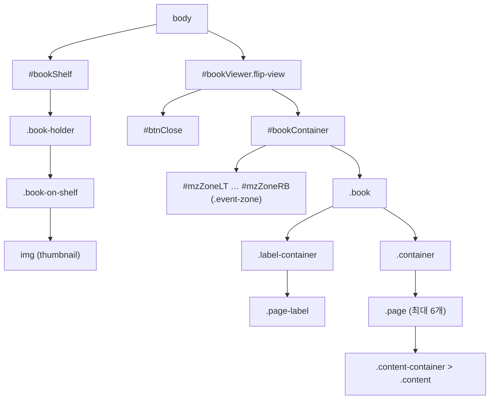

# 스타일 커스터마이징

## MagFlip이 만드는 DOM



`#bookShelf` 와 `#bookViewer` 가 문서에 없으면 `body` 끝에 자동으로 생성됩니다.
원하는 위치에 두고 싶다면 미리 빈 요소를 만들어 두세요.

## 자주 쓰는 커스터마이징

```css
/* 책장 썸네일 크기 */
#bookShelf .book,
#bookShelf .book-holder,
#bookShelf .book-on-shelf {
  width: 200px !important;
  height: 200px !important;
}

/* 뷰어 배경 */
#bookViewer.flip-view {
  background: #1f1f1f;
}

/* 닫기 버튼 */
#bookViewer #btnClose {
  background-color: #c2410c;
}
```

## 상태 클래스

| 클래스 (`#bookContainer`) | 의미 |
| --- | --- |
| `ready-to-open front` | 앞표지만 보이는 닫힌 상태 |
| `ready-to-open end` | 뒤표지만 보이는 닫힌 상태 |
| `left-page-flipping` / `right-page-flipping` | 왼쪽/오른쪽 페이지가 넘어가는 중 |

:::warning
MagFlip CSS에는 `img { width: 100%; height: 100%; }` 전역 규칙이 포함되어 있습니다.
페이지의 다른 이미지에 영향을 줄 수 있으니 필요하면 해당 영역에서 덮어쓰세요.
:::
