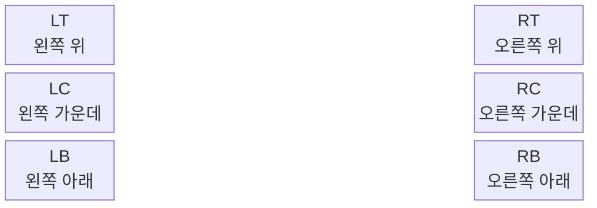
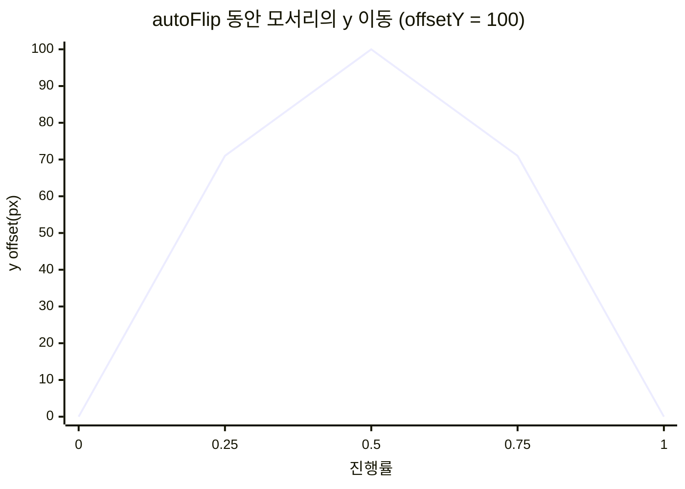

# 뷰어 제어

## 마우스로 넘기기

Flip 뷰는 책 위에 보이지 않는 **6개의 이벤트 영역(Zone)** 을 둡니다.



| 동작 | 결과 |
| --- | --- |
| Zone에 마우스 올리기 | 페이지 모서리가 마우스를 따라 살짝 들립니다. |
| Zone에서 마우스 벗어나기 | 모서리가 원래 위치로 돌아갑니다. |
| Zone에서 누른 채 드래그 | 페이지를 잡고 넘깁니다. |
| 마우스 놓기 | 반대편에 더 가까우면 넘어가고, 아니면 제자리로 돌아갑니다. |

오른쪽 Zone은 **다음 페이지**, 왼쪽 Zone은 **이전 페이지** 방향입니다.

## 코드로 넘기기

```js
flipView.nextPage();      // 다음 펼침으로
flipView.prevPage();      // 이전 펼침으로
flipView.moveTo(6);       // index 6 이 보이는 펼침으로 (애니메이션 1회)
```

| 메서드 | 설명 |
| --- | --- |
| `nextPage(offsetY?)` | 오른쪽 아래 모서리부터 자동으로 넘깁니다. |
| `prevPage(offsetY?)` | 왼쪽 아래 모서리부터 자동으로 넘깁니다. |
| `moveTo(pageIndex, offsetY?)` | 목표 페이지가 보이는 펼침으로 한 번에 넘깁니다. |

`offsetY` 는 넘기는 동안 모서리가 그리는 **곡선의 높이(px)** 입니다. 음수이면 위로, 양수이면 아래로 휩니다.



기본값은 `FlipView` 생성 시 바꿀 수 있습니다.

```js
const flipView = new FlipView({
  autoFlip: {
    forward:  { offsetY: -100 },
    backward: { offsetY: 100 },
  },
});
```

## 줌

```js
bookViewer.setZoomLevel(1.5); // 150%
```

## 뷰어 닫기와 이벤트

```js
const shelfManager = new BookShelfManager({
  hideBookShelf: true,
  onViewerClose: () => console.log('viewer closed'),
});

bookViewer.closeViewer(); // 코드로 닫기 (오른쪽 위 X 버튼과 동일)
```

## 뷰어 안에 내 버튼 넣기

`#bookViewer` 안에 직접 넣은 요소는 뷰어가 초기화될 때 제거됩니다.
유지하려면 `do-not-remove` 클래스를 붙이세요.

```html
<div id="bookViewer">
  <button class="do-not-remove" onclick="flipView.prevPage()">Prev</button>
  <button class="do-not-remove" onclick="flipView.nextPage()">Next</button>
</div>
```
