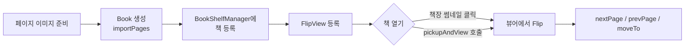
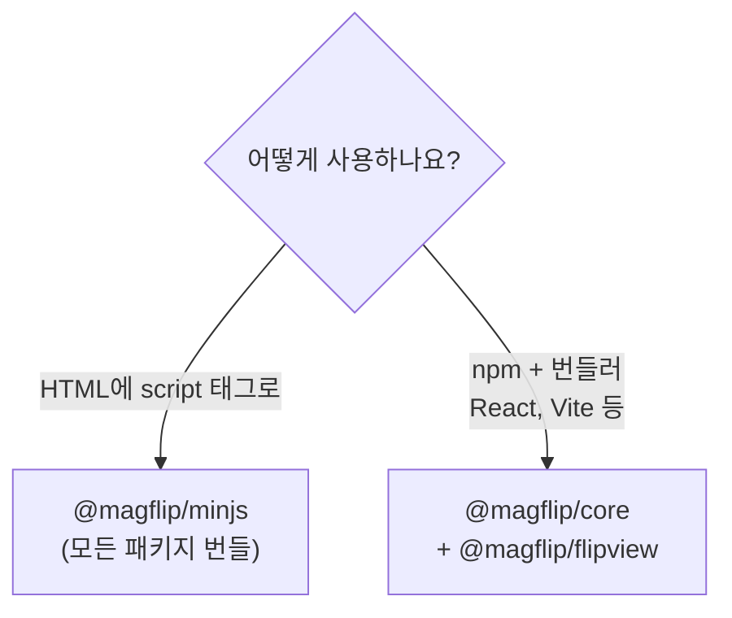

# MagFlip 소개

**MagFlip**은 웹 페이지에서 실제 책장을 넘기는 듯한 **Page Flip 효과**를 제공하는 JavaScript 라이브러리입니다.
마우스로 페이지 모서리를 잡아 끌거나, 버튼으로 다음/이전 페이지로 넘길 수 있습니다.

> Magzog = **Mag**azine + Blog. 책·잡지·신문 같은 인쇄 매체의 형식에 디지털 기능을 결합하는 것이 목표입니다.

## 무엇을 할 수 있나요?

| 기능 | 설명 |
| --- | --- |
| 📚 책장(Book Shelf) | 여러 권의 책 썸네일을 나열하고, 클릭하면 뷰어로 엽니다. |
| 📖 Flip 뷰어 | 페이지 모서리를 드래그하거나 자동 애니메이션으로 페이지를 넘깁니다. |
| 🔖 페이지 라벨 | 책 옆면에 색상 탭(라벨)을 달아 특정 페이지로 바로 이동합니다. |
| 🔍 줌 | 뷰어 전체를 확대/축소합니다. |

## 한눈에 보는 사용 흐름

## 어떤 패키지를 써야 하나요?

| 패키지 | 용도 |
| --- | --- |
| `@magflip/minjs` | 모든 패키지를 하나로 묶은 브라우저용 번들(`magflip.min.js`). CDN으로 바로 사용 |
| `@magflip/core` | `Book`, `Page`, `BookShelfManager`, `BookViewer` 등 핵심 객체 |
| `@magflip/flipview` | 책장을 넘기는 형태로 보여주는 뷰 플러그인 `FlipView` |
| `@magflip/scrollview` | 스크롤 형태 뷰 플러그인 (🚧 개발 중) |

## 다음 단계

- [빠른 시작](./getting-started/quick-start.md) — 5분 만에 첫 Flip Book 띄우기
- [Live Demo](./demo.mdx) — 바로 동작을 확인하기
