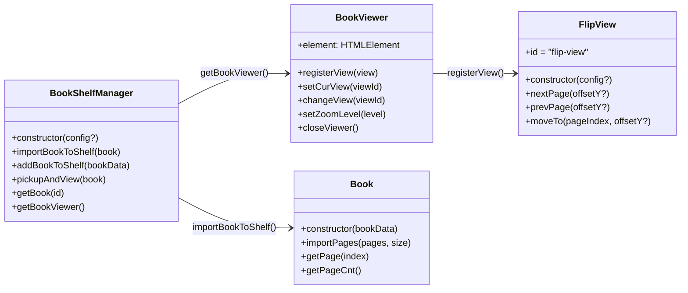

# API 레퍼런스

사용자가 직접 호출하는 공개 API만 정리했습니다.



## BookShelfManager

`@magflip/core`

```ts
new BookShelfManager(config?: IBookShelfManagerConfig)
```

| config | 타입 | 기본값 | 설명 |
| --- | --- | --- | --- |
| `hideBookShelf` | `boolean` | `false` | 책장(`#bookShelf`)을 숨깁니다. |
| `onViewerClose` | `() => void` | – | 뷰어가 닫힌 뒤 호출됩니다. |

| 메서드 | 설명 |
| --- | --- |
| `importBookToShelf(book: Book)` | 생성한 `Book` 을 책장에 추가합니다. |
| `addBookToShelf(data: IBookData)` | 데이터로 `Book` 을 만들어 책장에 추가합니다. |
| `pickupAndView(book: Book)` | 책을 뷰어로 엽니다. 이미 열려 있으면 무시합니다. |
| `returnBookToShelf(book)` | 책을 책장으로 되돌립니다. (보통 `closeViewer` 가 호출) |
| `getBook(id)` | 책장에 있는 `Book` 을 id로 찾습니다. |
| `getBookViewer()` | `BookViewer` 인스턴스를 반환합니다. |

## BookViewer

`@magflip/core` · `shelfManager.getBookViewer()` 로 얻습니다.

| 멤버 | 설명 |
| --- | --- |
| `element` | `#bookViewer` 요소 |
| `registerView(view: IBookView)` | 뷰 플러그인을 등록합니다. 처음 등록한 뷰가 기본 뷰가 됩니다. |
| `setCurView(viewId)` / `changeView(viewId)` | 사용할 뷰를 선택합니다. |
| `setZoomLevel(level: number)` | 줌 배율을 설정합니다. |
| `closeViewer()` | 뷰어를 닫고 책을 책장으로 되돌립니다. |

## Book

`@magflip/core`

| 멤버 | 설명 |
| --- | --- |
| `new Book(data: IBookData)` | [책 옵션](../guides/book-and-pages.md#book-옵션) 참고 |
| `importPages(pages: IPageData[], size: ISize)` | 페이지들을 추가하고 한 쪽 페이지 크기를 설정합니다. |
| `getPage(index)` | 페이지 객체를 반환합니다. |
| `getPageCnt()` | 로드된 페이지 수를 반환합니다. |
| `size.closed` / `size.opened` | 닫힌/펼친 책 크기 (`width`, `height`, `diagonal`) |

## FlipView

`@magflip/flipview`

```ts
new FlipView(config?: IFlipViewConfig)
```

| config | 기본값 | 설명 |
| --- | --- | --- |
| `autoFlip.forward.offsetY` | `100` | `nextPage` 곡선 높이(px) |
| `autoFlip.backward.offsetY` | `-100` | `prevPage` 곡선 높이(px) |

| 메서드 | 설명 |
| --- | --- |
| `nextPage(offsetY?)` | 다음 펼침으로 넘깁니다. 마지막이면 무시합니다. |
| `prevPage(offsetY?)` | 이전 펼침으로 넘깁니다. 처음이면 무시합니다. |
| `moveTo(pageIndex, offsetY?)` | 해당 페이지가 보이는 펼침으로 이동합니다. |

## Enum

| Enum | 값 |
| --- | --- |
| `BookType` | `Book`, `Magazine`, `Newspaper` |
| `PageType` | `Page`, `Cover`, `Empty`, `Blank` |
| `PageLabelType` | `Default`, `Empty` |
